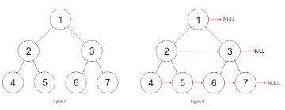

# 116. Populating Next Right Pointers in Each Node

Author: zhuofei

## Problem
You are given a perfect binary tree where all leaves are on the same level, and every parent has two children. The binary tree has the following definition:  
```
struct Node {
  int val;
  Node *left;
  Node *right;
  Node *next;
}
```
Populate each next pointer to point to its next right node. If there is no next right node, the next pointer should be set to NULL.

Initially, all next pointers are set to NULL.

You may only use constant extra space.

Recursive approach is fine, you may assume implicit stack space does not count as extra space for this problem.



## Note

you need to make use of the next links that you're creating.

## Solution

```
public void connect(TreeLinkNode root) {
    TreeLinkNode level_start=root;
    while(level_start!=null){
        TreeLinkNode cur=level_start;
        while(cur!=null){
            if(cur.left!=null) cur.left.next=cur.right;
            if(cur.right!=null && cur.next!=null) cur.right.next=cur.next.left;
            cur=cur.next;
        }
        level_start=level_start.left;
    }
}
```