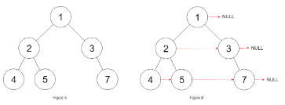

# 117. Populating Next Right Pointers in Each Node II

Author: Zhuofei 5.21  
Rating: 4.0/5.0

## Problem
Difference with 116: Not a perfect binary tree

## Ideas

I think it is similiar to double pointer, one is for current level, the other is tracked the child level.  
The first pointer is to find next node until it has one or two children, another pointer will assign it to last node.next in the child level.

